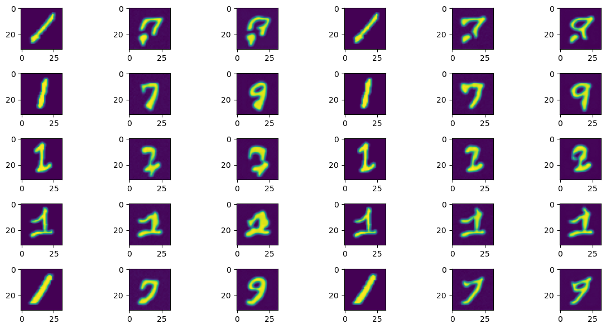

# Schrodinger-Bridge-Flow-PyTorch

This repository reproduces the work from the paper [*"Schrödinger Bridge Flow for Unpaired Data Translation"*](https://arxiv.org/abs/2409.09347), focusing on implementing the Schrödinger Bridge (SB) framework for unpaired data translation. The model is demonstrated on the MNIST dataset to showcase its ability to learn stochastic dynamics between distributions.

## Requirements

- Python 3.7+
- PyTorch 1.8+
- torchvision
- scikit-learn
- numpy
- matplotlib
- tqdm

---

## 📂 Code Structure

### 1. `__init__.py`
- Initializes the package, importing key modules: `utils`, `networks`, and `model`.

### 2. `model.py`
- **Main implementation** of the Schrödinger Bridge model (`sb_muti_model` class).
- Contains:
  - Pretraining (`run_base`) and finetuning (`finetuning`) logic.
  - Forward/backward dynamics simulation (`fwd`, `bwd`).
  - EMA (Exponential Moving Average) for model stability.
  - Training utilities (loss tracking, checkpoint saving/loading).

### 3. `networks.py`
- **Neural network architectures**:
  - `SimpleUNet`: A U-Net with AdaIN layers for conditional normalization.
  - `AdaIN`: Adaptive Instance Normalization for incorporating time embeddings.
  - `scale_model_muti`: Time- and stage-aware scaling model.
  - `CustomDataset`: Wrapper for dataset handling.

---


## MNIST Example

### Data Preparation

The MNIST dataset is loaded and preprocessed. The images are resized to 32x32 and normalized using MinMaxScaler to scale the pixel values between -10 and 10.

```python
transform = transforms.Compose([
    transforms.Resize((32, 32)),  
    transforms.ToTensor(),        
])
train_data  = MNIST(
    root = "./data", 
    train = True, 
    transform  = transform,
    download= False  
)
def extract_transformed_data(dataset, labels):
    data = []
    for i in range(len(dataset)):
        if dataset.targets[i]==labels:
            img, label = dataset[i]  
            data.append(img.numpy())  
    return torch.tensor(np.stack(data,axis=0))
scaler = MinMaxScaler(feature_range=(-10, 10))
digit_1_data = extract_transformed_data(train_data,1)
digit_7_data = extract_transformed_data(train_data,7)
digit_9_data = extract_transformed_data(train_data,9)
digit_1_data = digit_1_data.reshape(digit_1_data.shape[0],-1)
digit_7_data = digit_7_data.reshape(digit_7_data.shape[0],-1)
digit_9_data = digit_9_data.reshape(digit_9_data.shape[0],-1)
scaler.fit(torch.cat([digit_1_data,digit_7_data,digit_9_data],dim=0))
digit_1_scaled=torch.from_numpy(scaler.transform(digit_1_data))
digit_7_scaled=torch.from_numpy(scaler.transform(digit_7_data))
digit_9_scaled=torch.from_numpy(scaler.transform(digit_9_data))
```

### Model Initialization

The SB-MODEL is initialized with the scaled data for digits 1, 7, and 9. The model is configured with specific hyperparameters such as the number of pretraining and finetuning steps, learning rates, and regularization parameters.
``` python
steps = 30*2
eps = 10
eps_test = 10
sb_object = model.sb_muti_model(
    [digit_1_scaled, digit_7_scaled, digit_9_scaled],
    [0, 1, 2],
    N_pretraining=200,
    N_finetuning=50,
    base_lr=1e-3,
    finetuning_lr=1e-3,
    steps=steps,
    eps=eps,
    patience=20000,
    B=128,
    lambda_=1e-3,
    clamp=False,
    save=True
)
```

### Training the Model/ Loading the Model

#### Training

**Pretraining**: Run the base training phase to initialize the model parameters.
```python
sb_object.run_base()
```

**Finetuning**: Fine-tune the model to improve performance.
```python
sb_object.finetuning()
```

#### Loading

This repository provides a trained model saved in the 'model_history'.
```python
sb_object.backbone_load()
sb_object.finetuning_load()
```

### Evaluation

After training, the model is evaluated on the test data. The `eval_fore` and `eval_back` methods are used to evaluate the model's performance on the forward and backward passes, respectively. For the sake of memory limitation, only 128 pictures are generated.
``` python
fore_base=sb_object.eval_fore(digit_1_scaled.double()[:128,:],sb_object.v_fore,eps_test=eps_test)
back_base=sb_object.eval_back(digit_9_scaled.double()[:128,:],sb_object.v_back,eps_test=eps_test)
fore_ft=sb_object.eval_fore(digit_1_scaled.double()[:128,:],sb_object.v_fore_copy,eps_test=eps_test)
back_ft=sb_object.eval_back(digit_9_scaled.double()[:128,:],sb_object.v_back_copy,eps_test=eps_test)
```

### Result Visualization
Forward Model result (backbone result on the left and finetuning result on the right):


Backward Model result (backbone result on the left and finetuning result on the right):
